# Ondo State Bimodal E-Voting System Plan

## Clean Mermaid Diagrams For Drawing

These versions are designed to render like clean block diagrams. They avoid custom colors so they can be pasted into Mermaid Live, draw.io Mermaid import, GitHub, or a Markdown preview.

### A. System Architecture

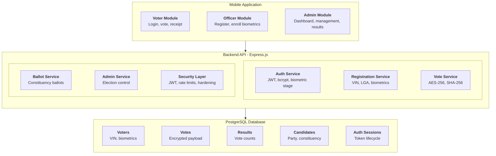

### B. Admin Setup And Officer Registration Flow

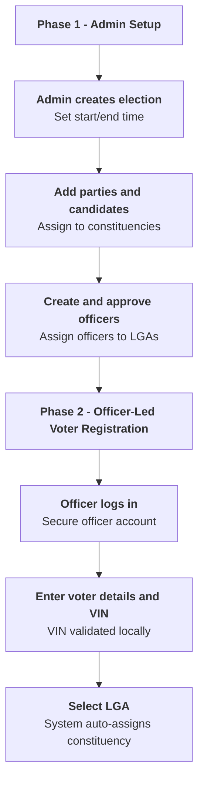

### C. Biometric Enrollment And Account Creation

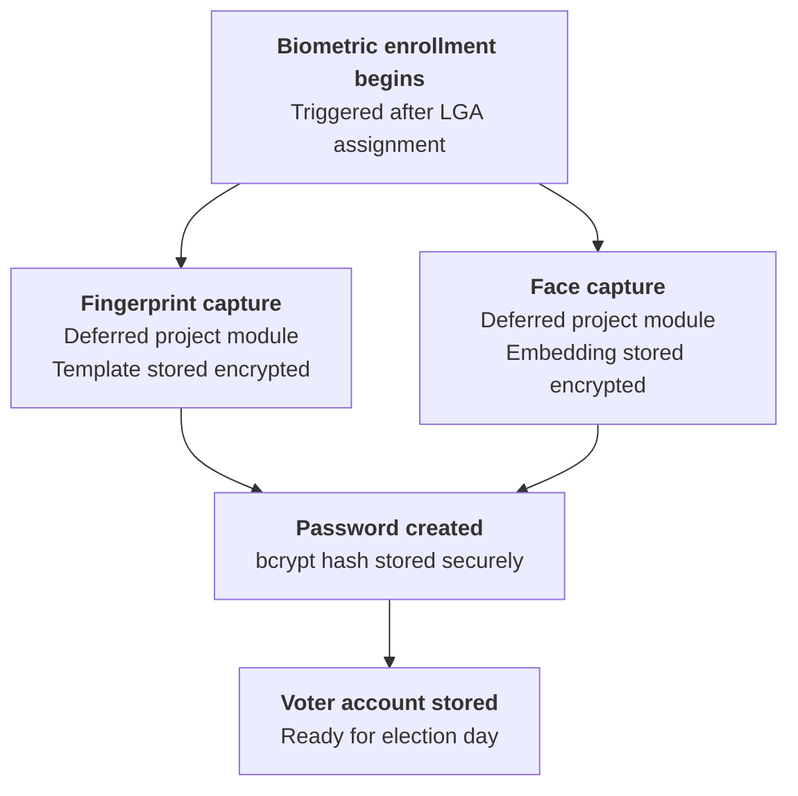

### D. Election-Day Voting Flow

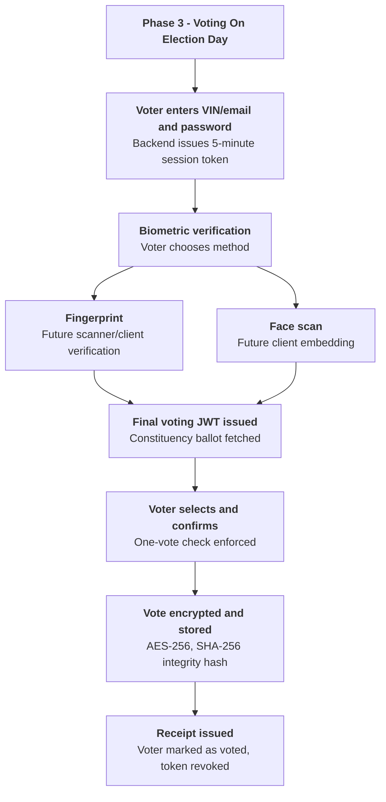

### E. Roles And Permissions

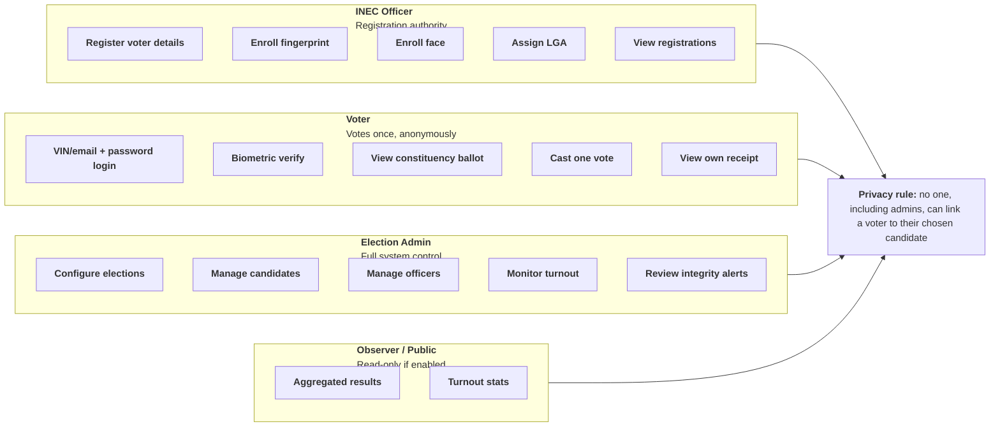

## 1. System Architecture

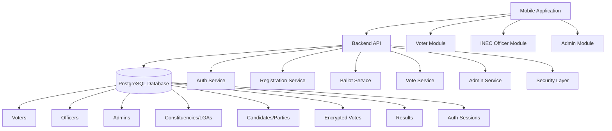

## 2. Main User Roles

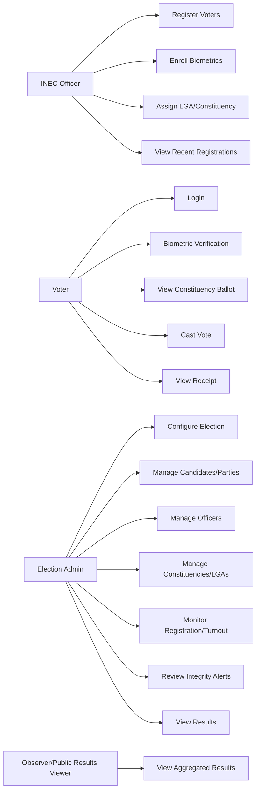

## 3. Role Responsibilities

| Action | Voter | INEC Officer | Admin | Observer |
| --- | --- | --- | --- | --- |
| Register voter details | No | Yes | Monitor only | No |
| Enroll biometrics | No | Yes | Monitor only | No |
| Login for voting | Yes | No | No | No |
| Biometric verification | Yes | No | No | No |
| Cast vote | Yes | No | No | No |
| View own receipt | Yes | No | No | No |
| Create/manage elections | No | No | Yes | No |
| Add/manage parties | No | No | Yes | No |
| Add/manage candidates | No | No | Yes | No |
| Manage officers | No | No | Yes | No |
| Monitor turnout | No | Limited | Yes | Read-only if enabled |
| View results | No during voting | No | Yes | Read-only if enabled |
| Export results | No | No | Yes | Optional |
| Receive anomaly alerts | No | No | Yes | No |
| See individual ballots | No | No | No | No |

The privacy rule is that nobody, including admins, should be able to see which voter selected which candidate. Admins only see aggregated results and high-level security/integrity alerts.

## 4. End-To-End Election Flow

```mermaid
flowchart TD
    S[Start] --> A[Admin creates election]
    A --> B[Admin adds parties and candidates]
    B --> C[Admin assigns candidates to constituencies]
    C --> D[Admin creates/approves INEC officers]

    D --> E[Officer logs in]
    E --> F[Officer enters voter details]
    F --> G[System validates VIN locally]
    G --> H[Officer selects LGA]
    H --> I[System auto-assigns constituency]
    I --> J[Fingerprint enrollment represented at API level for now]
    J --> K[Face template or embedding represented at API level for now]
    K --> L[Password is created]
    L --> M[Voter account stored securely]

    M --> N[Voter opens app on election day]
    N --> O[Voter enters VIN/email and password]
    O --> P[Backend verifies password with bcrypt]
    P --> Q[Backend issues temporary 5-minute session token]
    Q --> R[Voter chooses fingerprint or face verification]

    R --> R1[Fingerprint: submitted scanner/client verification]
    R --> R2[Face: submitted template or embedding]

    R1 --> S1[Backend verifies biometric stage]
    R2 --> S1

    S1 --> T[Backend issues final voting JWT]
    T --> U[System fetches only voter's constituency ballot]
    U --> V[Voter selects candidate]
    V --> W[Voter confirms vote]
    W --> X[Backend checks voter has not voted]
    X --> Y[Backend encrypts vote with AES-256]
    Y --> Z[Backend generates SHA-256 integrity hash]
    Z --> AA[Vote stored and results updated]
    AA --> AB[Voter marked as voted]
    AB --> AC[Voting token invalidated]
    AC --> AD[Voter receives non-revealing receipt]
    AD --> AE[Admin monitors turnout, alerts, and results]
```

## 5. Admin Module Plan

```mermaid
flowchart TD
    Admin[Admin Login] --> Dashboard[Election Dashboard]

    Dashboard --> Elections[Manage Elections]
    Dashboard --> Parties[Manage Parties]
    Dashboard --> Candidates[Manage Candidates]
    Dashboard --> Officers[Manage INEC Officers]
    Dashboard --> Voters[Monitor Voter Registration]
    Dashboard --> Turnout[Monitor Turnout]
    Dashboard --> Results[View Constituency Results]
    Dashboard --> Alerts[Security/Integrity Alerts]

    Elections --> E1[Create Election]
    Elections --> E2[Set Start/End Time]
    Elections --> E3[Open/Close Election]

    Parties --> P1[Add Party]
    Parties --> P2[Edit Party]
    Parties --> P3[Deactivate Party]

    Candidates --> C1[Add Candidate]
    Candidates --> C2[Assign Candidate to Party]
    Candidates --> C3[Assign Candidate to Constituency]
    Candidates --> C4[Edit/Deactivate Candidate]

    Officers --> O1[Create Officer Account]
    Officers --> O2[Assign Officer to LGA/Center]
    Officers --> O3[Disable Officer Account]

    Alerts --> A1[Double-Vote Attempt]
    Alerts --> A2[Invalid Constituency Access]
    Alerts --> A3[Repeated Failed Biometric Attempts]
    Alerts --> A4[Unusual Turnout Pattern]
```

## 6. Backend Plan

```mermaid
flowchart TD
    API[Express Backend API] --> Auth[Authentication Routes]
    API --> Ballot[Ballot Routes]
    API --> Vote[Vote Routes]
    API --> Admin[Admin Routes]
    API --> Security[Security Middleware]

    Auth --> A1[Officer Login]
    Auth --> A2[Voter Registration]
    Auth --> A3[Voter Login]
    Auth --> A4[Biometric Verification]
    Auth --> A5[Password Reset]

    Ballot --> B1[Fetch Constituencies]
    Ballot --> B2[Fetch Constituency Candidates]

    Vote --> V1[Validate Voting JWT]
    Vote --> V2[Check Has Voted]
    Vote --> V3[Validate Candidate Constituency]
    Vote --> V4[Encrypt Vote]
    Vote --> V5[Generate Receipt/Hash]
    Vote --> V6[Update Results]

    Admin --> AD1[Admin Login]
    Admin --> AD2[Dashboard]
    Admin --> AD3[Manage Candidates]
    Admin --> AD4[Manage Parties]
    Admin --> AD5[Manage Elections]
    Admin --> AD6[Manage Officers]
    Admin --> AD7[View Results]

    Security --> S1[JWT]
    Security --> S2[bcrypt]
    Security --> S3[AES-256-GCM]
    Security --> S4[SHA-256]
    Security --> S5[Rate Limiting]
```

## 7. Database Plan

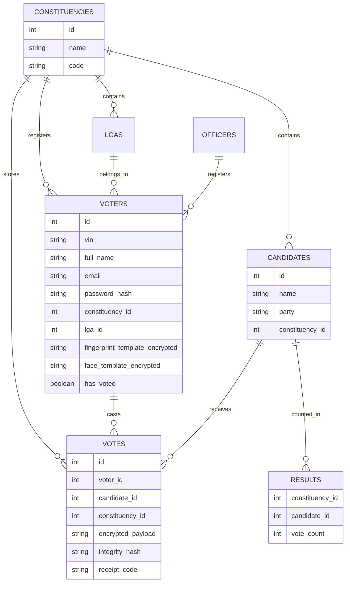

## 8. Prototype Scope

```text
What works in the prototype:
- Officer-led voter registration
- VIN captured and validated locally
- LGA-to-constituency assignment
- Fingerprint/face verification modeled at backend API level
- Biometric samples/templates accepted at API level for now
- Password hashing
- Staged authentication
- Constituency-specific ballots
- AES-256 encrypted vote storage
- SHA-256 integrity hash
- One-voter-one-vote enforcement
- Admin dashboard and results
- Admin election/candidate/party/officer management planned as the next module expansion

Production integrations needed later:
- Live INEC voter register/VIN validation
- Project fingerprint verification module
- Project face recognition/liveness module
- Full candidate/election management approval workflow
- Production email/SMS providers
- Hosting, backups, monitoring, and independent security audit
- Audit logging for sensitive election/admin events
```
